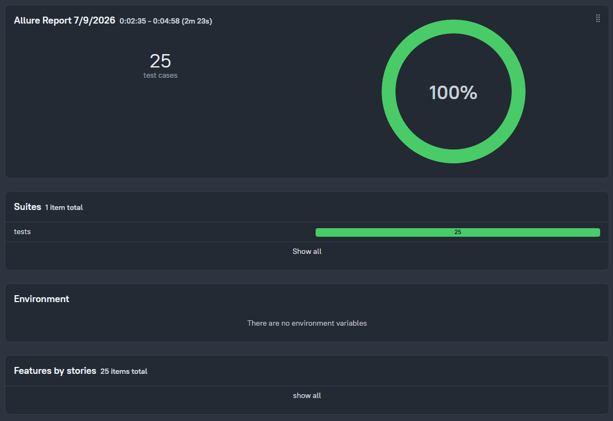
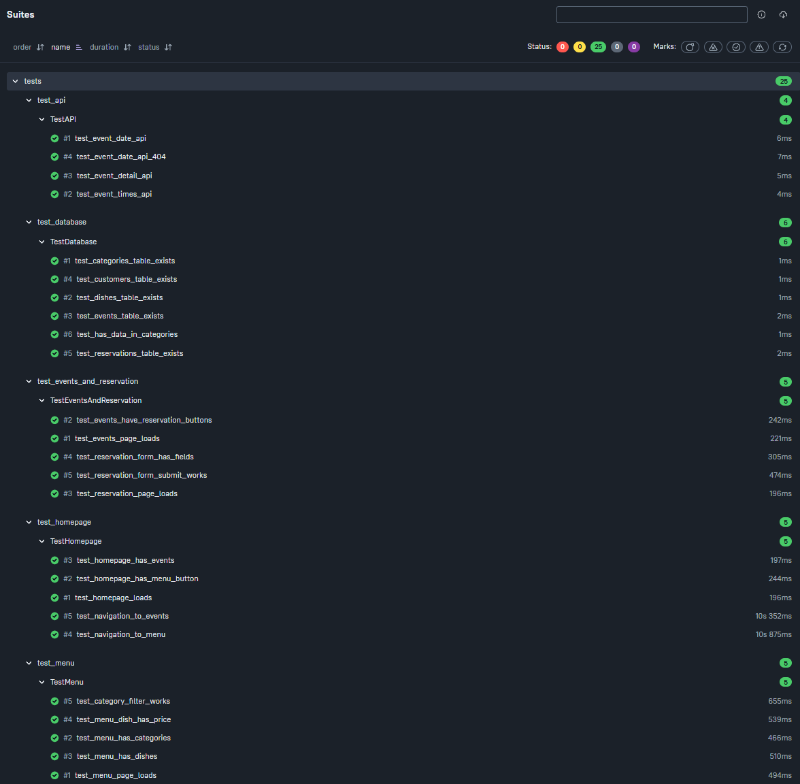

# 🧪 QA-тесты для сайта «Пивница»

> Автоматизированное тестирование веб-сайта бар-ресторана «Пивница» с использованием Selenium, pytest и Allure.


---

## 📋 О проекте

Проект содержит **автоматизированные тесты** для проверки веб-сайта бар-ресторана «Пивница». Он был создан в рамках изучения QA-автоматизации и демонстрирует навыки:

- UI-тестирование (Selenium WebDriver)
- API-тестирование (requests)
- Тестирование базы данных (sqlite3)
- Настройка CI/CD (GitHub Actions)
- Генерация отчётов (Allure)

## 🎯 Целевой проект

Данный набор тестов предназначен для автоматизированной проверки веб-сайта бар-ресторана «Пивница».

- **Репозиторий проекта:** [github.com/ShurikPozd/pivnica_portal](https://github.com/ShurikPozd/pivnica_portal)
- **Стек целевого проекта:** Django 4.2, SQLite, Bootstrap 5
- **Описание:** Веб-сайт с функционалом онлайн-бронирования, меню и афиши мероприятий.

---

## 🛠 Технологии

| Технология | Назначение |
|------------|------------|
| **pytest** | Фреймворк для запуска тестов |
| **Selenium WebDriver** | UI-автоматизация в браузере |
| **requests** | Тестирование REST API |
| **sqlite3** | Проверка данных в базе |
| **Allure** | Красивые отчёты о тестировании |
| **GitHub Actions** | Автоматический запуск тестов при пуше |

---

## 📁 Структура проекта

```
qa_pivnica/
├── tests/
│   ├── __init__.py
│   ├── conftest.py              # Фикстуры (драйвер, API, БД)
│   ├── test_homepage.py         # Тесты главной страницы (5 тестов)
│   ├── test_menu.py             # Тесты меню (5 тестов)
│   ├── test_events_and_reservation.py  # Тесты афиши и бронирования (5 тестов)
│   ├── test_api.py              # API-тесты (4 теста)
│   └── test_database.py         # БД-тесты (6 тестов)
├── drivers/
│   └── chromedriver.exe         # ChromeDriver (устанавливается вручную)
├── allure-results/              # Результаты для Allure
├── requirements.txt
├── pytest.ini
├── .gitignore
└── README.md
```

---

## 🧪 Что проверяют тесты

### 📊 Общая статистика

| Категория | Количество тестов |
|-----------|-------------------|
| UI-тесты (Selenium) | 15 |
| API-тесты (requests) | 4 |
| БД-тесты (sqlite3) | 6 |
| **Всего** | **25** |

---

### UI-тесты (Selenium)

| Файл | Страница | Что проверяется |
|------|----------|-----------------|
| `test_homepage.py` | Главная | Загрузка, кнопки, навигация, мероприятия |
| `test_menu.py` | Меню | Категории, блюда, цены, фильтрация |
| `test_events_and_reservation.py` | Афиша и бронирование | Карточки, форма, поля, отправка |

---

### API-тесты (requests)

| Файл | Эндпоинт | Что проверяется |
|------|----------|-----------------|
| `test_api.py` | `/api/event-date/1/` | Получение даты мероприятия |
| `test_api.py` | `/api/event-times/1/` | Получение времени |
| `test_api.py` | `/api/event-detail/1/` | Получение деталей |
| `test_api.py` | `/api/event-date/9999/` | Корректная обработка 404 |

---

### БД-тесты (sqlite3)

| Файл | Таблица | Что проверяется |
|------|---------|-----------------|
| `test_database.py` | `portal_category` | Существует, есть данные |
| `test_database.py` | `portal_dish` | Существует, есть данные |
| `test_database.py` | `portal_event` | Существует, есть данные |
| `test_database.py` | `portal_customer` | Существует |
| `test_database.py` | `portal_reservation` | Существует |

---

## 🚀 Установка и запуск

### 1. Клонируйте репозиторий

```bash
git clone https://github.com/ShurikPozd/qa_pivnica.git
cd qa_pivnica
```

### 2. Установите зависимости

```bash
python -m venv .venv
source .venv/Scripts/activate  # Windows
# или
source .venv/bin/activate      # Linux/macOS

pip install -r requirements.txt
```

### 3. Установите ChromeDriver

Скачайте ChromeDriver под свою версию Chrome:  
[Chrome for Testing](https://googlechromelabs.github.io/chrome-for-testing/)

Положите `chromedriver.exe` в `drivers/chromedriver.exe`

### 4. Запустите сайт «Пивница»

```bash
cd ../pivnica_portal
python manage.py runserver
```

### 5. Запустите тесты

```bash
cd ../qa_pivnica
pytest -v
```

### 6. Сгенерируйте отчёт Allure

```bash
pytest --alluredir=allure-results
allure serve allure-results
```

---

## 📊 Пример вывода тестов

```bash
$ pytest -v

collected 25 items

tests/test_api.py ....                                              [ 16%]
tests/test_database.py ......                                        [ 40%]
tests/test_events_and_reservation.py .....                           [ 60%]
tests/test_homepage.py .....                                         [ 80%]
tests/test_menu.py .....                                             [100%]

=============================== 25 passed in 120.0s ================================
```

## 📸 Пример отчёта Allure

### Общая статистика



### Структура тестов (Suites)



---

## 🔧 Особенности реализации

### Фикстуры в conftest.py

| Фикстура | Назначение |
|----------|------------|
| `driver` | Создаёт и закрывает браузер для каждого теста |
| `api_base_url` | Базовый URL для API-тестов |
| `db_connection` | Подключение к SQLite для проверки данных |

### Обработка ошибок

- Клик через JavaScript (обходит перекрытия элементов)
- Fallback-селекторы для поиска элементов
- Ожидание загрузки страниц (WebDriverWait)

### Режим headless

По умолчанию браузер не отображается (`--headless`).  
Если вы хотите видеть процесс выполнения — закомментируйте эту строку в `conftest.py`:

```python
# options.add_argument("--headless")
```

---

## 🔄 CI/CD (GitHub Actions)

Тесты автоматически запускаются при каждом пуше в ветку `main`.  
Код для CI лежит в `.github/workflows/qa_tests.yml`.

---

## 📌 Планы по развитию

- [ ] Добавить тесты для бумажного меню
- [ ] Настроить параллельный запуск тестов (pytest-xdist)
- [ ] Интегрировать с Allure TestOps
- [ ] Добавить тесты на мобильную версию
- [ ] Расширить покрытие API-тестов

---

## 🐛 Известные проблемы

| Проблема | Решение |
|----------|---------|
| `ElementNotInteractableException` | Использован клик через `execute_script` |
| `NoSuchElementException` | Добавлены fallback-селекторы |
| База данных не найдена | Выполните миграции в `pivnica_portal` |

---

## 🤝 Как использовать этот проект

Этот проект создан в учебных целях. Если вы хотите адаптировать его под свой сайт:

1. Замените URL в фикстурах (`api_base_url`, `driver.get()`)
2. Адаптируйте селекторы под свой DOM
3. Добавьте свои тесты

---

## 📄 Лицензия

MIT © [ShurikPozd](https://github.com/ShurikPozd)

---

## 📬 Контакты

- GitHub: [ShurikPozd](https://github.com/ShurikPozd)
- Telegram: [@shurikpozd](https://t.me/shurikpozd)

---

## ⭐ Поддержка

Если проект вам понравился, поставьте ⭐ на GitHub!

---

**Сделано с ❤️ для портфолио**